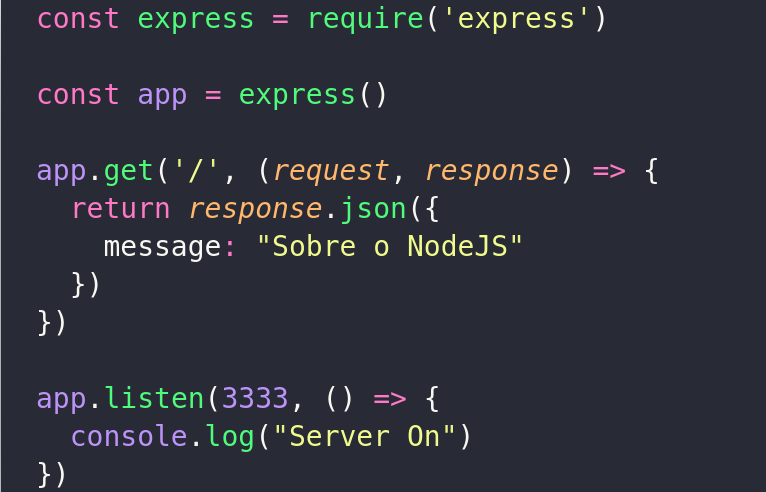

## 1. Servidor NodeJs com **`Framework Express`**
   

  * Instância o Express.
  * Excuta o Servidor na porta `3333`.
  * Utiliza o `*VERBO GET*` do  `*HTTPS VERBS*`


## 2. Utilização da **`Biblioteca Nodemon`**

```bash
  npm install nodemon -D
```
  * Aplicar leitura de código automática no Servidor.
  * Deve-se configurar o scrip no package.json para executar a aplicação.
  
  